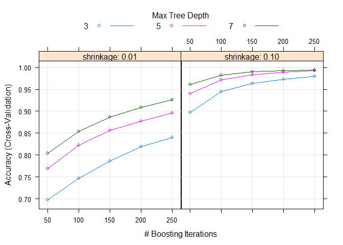

# Machine Learning Class Project
Derek Franks  
June 20, 2015  


#Introduction
The purpose of this data analysis is to use data collected from accellerometers located on the belt, forearm, arm, and dumbell of 6 participants to predict the type of exercise they were engaged in.

The training data set consists of 19622 observations of 160 variables, including a "target" variable, `classe` that identifies the type of exercise.  It is coded A through E.

The test data consists of 20 observations of 160 variables.

#Analysis
##Data Cleaning
I began the analysis by cleaning up the training data set.  A number of variables consisted largely of missing or NA data.  So I began by removing variables that contained NA values.  Also removed the `classe` variable, along with several other variables that were not likely to be predictive such as the record number, user name and timestamp data.

I then converted the remaining variables to numeric as a number had been incorrectly read in as factor or logical variables.  I then re-added the `classe` variable to the data set.

This left me with a training data set consisting of 19622 observations of 88 variables.


```r
setwd("C:/Users/Derek/Documents/My Dropbox/Projects/machine_learning")
train <- read.csv("pml-training.csv")
test <- read.csv("pml-testing.csv")

filteredTrain <- train[, !unlist(lapply(train, function(x) any(is.na(x))))]
filteredTrain <- filteredTrain[, -c(1:5,93)]
filteredTrain <- as.data.frame(lapply(filteredTrain, as.numeric))
filteredTrain <- cbind(classe = train$classe, filteredTrain)
dim(filteredTrain)
```

```
## [1] 19622    88
```

##Modeling
I decided to use a the `gbm` model.  This is a stochastic gradient boosted model that is quite robust for both classification and regression.  Because it is fundamentally a decision tree based model, it is also quite good at dealing with a large number of variables without having to engage in PCA or other variable selection techniques.

I used a standard 10-fold cross validation approach to optimize the model.  Additionally, I used a custom parameter tuning grid.  I checked the model at a 3, 5, and 7 level interaction depth, 50 through 250 trees, and both .01 and .1 shrinkage levels (essentially a "slow" and "fast" learner).


```r
fitControl <- trainControl(method = "cv",
                           number = 10)

gbmGrid <-  expand.grid(interaction.depth = c(3, 5, 7),
                        n.trees = (1:5)*50,
                        shrinkage = c(0.01, 0.1),
                        n.minobsinnode = 10)
```


```r
set.seed(42)
gbmFit <- train(classe ~ ., data = filteredTrain,
                method = "gbm",
                trControl = fitControl,
                tuneGrid = gbmGrid,
                verbose = FALSE)
```

##Final model and error estimates
Optimal accuracy was achieved with 250 trees, an interaction depth of 7 and a shrinkage of 0.1.  This approach achieved accuracy of .9994904 on the training data.  This suggests that we're likely to see better than .99 out-of-sample accuracy given that the 10-fold cross-validation is still slightly biased towards the training data and gbm models, like many tree based models, can occassionally overfit the training data.


```
## Stochastic Gradient Boosting 
## 
## 19622 samples
##    87 predictor
##     5 classes: 'A', 'B', 'C', 'D', 'E' 
## 
## No pre-processing
## Resampling: Cross-Validated (10 fold) 
## 
## Summary of sample sizes: 17659, 17661, 17661, 17659, 17661, 17660, ... 
## 
## Resampling results across tuning parameters:
## 
##   shrinkage  interaction.depth  n.trees  Accuracy   Kappa    
##   0.01       3                   50      0.7074704  0.6298486
##   0.01       3                  100      0.7637332  0.7004280
##   0.01       3                  150      0.8030765  0.7502746
##   0.01       3                  200      0.8428795  0.8008240
##   0.01       3                  250      0.8690751  0.8340383
##   0.01       5                   50      0.7815717  0.7236075
##   0.01       5                  100      0.8475683  0.8068483
##   0.01       5                  150      0.8845168  0.8536399
##   0.01       5                  200      0.9112731  0.8875690
##   0.01       5                  250      0.9318110  0.9136428
##   0.01       7                   50      0.8373763  0.7937223
##   0.01       7                  100      0.8972576  0.8698114
##   0.01       7                  150      0.9261030  0.9063508
##   0.01       7                  200      0.9477127  0.9337884
##   0.01       7                  250      0.9598426  0.9491667
##   0.10       3                   50      0.9336981  0.9160829
##   0.10       3                  100      0.9730420  0.9658917
##   0.10       3                  150      0.9896552  0.9869143
##   0.10       3                  200      0.9948021  0.9934254
##   0.10       3                  250      0.9974519  0.9967770
##   0.10       5                   50      0.9722773  0.9649160
##   0.10       5                  100      0.9939866  0.9923936
##   0.10       5                  150      0.9977576  0.9971636
##   0.10       5                  200      0.9989807  0.9987107
##   0.10       5                  250      0.9990827  0.9988397
##   0.10       7                   50      0.9877699  0.9845275
##   0.10       7                  100      0.9975029  0.9968415
##   0.10       7                  150      0.9990827  0.9988397
##   0.10       7                  200      0.9993375  0.9991620
##   0.10       7                  250      0.9994904  0.9993554
##   Accuracy SD   Kappa SD    
##   0.0111388678  0.0141186437
##   0.0086194218  0.0110733997
##   0.0107362748  0.0137790287
##   0.0088463150  0.0112967677
##   0.0081831468  0.0104105682
##   0.0063829239  0.0081392930
##   0.0065293372  0.0084184740
##   0.0063194490  0.0080982042
##   0.0071443607  0.0091214008
##   0.0058585577  0.0074556735
##   0.0098408258  0.0126266569
##   0.0071491480  0.0091326718
##   0.0073074549  0.0093158385
##   0.0067836878  0.0086045826
##   0.0059361034  0.0075178457
##   0.0057321692  0.0072728574
##   0.0051238715  0.0064770738
##   0.0018096855  0.0022883425
##   0.0011194364  0.0014155973
##   0.0005368183  0.0006791024
##   0.0057148979  0.0072373270
##   0.0012422430  0.0015712918
##   0.0009366066  0.0011847872
##   0.0010191519  0.0012892085
##   0.0009547237  0.0012077160
##   0.0030998659  0.0039210904
##   0.0006978107  0.0008825282
##   0.0006706796  0.0008483754
##   0.0004834346  0.0006114844
##   0.0004805348  0.0006078156
## 
## Tuning parameter 'n.minobsinnode' was held constant at a value of 10
## Accuracy was used to select the optimal model using  the largest value.
## The final values used for the model were n.trees = 250,
##  interaction.depth = 7, shrinkage = 0.1 and n.minobsinnode = 10.
```

```
## A gradient boosted model with multinomial loss function.
## 250 iterations were performed.
## There were 87 predictors of which 53 had non-zero influence.
```

 

```
## Cross-Validated (10 fold) Confusion Matrix 
## 
## (entries are cell counts per resample)
##  
##           Reference
## Prediction    A    B    C    D    E
##          A 5579    3    0    0    0
##          B    1 3794    2    0    0
##          C    0    0 3420    0    0
##          D    0    0    0 3216    4
##          E    0    0    0    0 3603
```

Additionally, we can look at the relative variable importance of the final model.  

```r
varImp(gbmFit)
```

```
## gbm variable importance
## 
##   only 20 most important variables shown (out of 87)
## 
##                   Overall
## num_window        100.000
## roll_belt          56.720
## pitch_forearm      30.873
## yaw_belt           25.931
## magnet_dumbbell_z  20.251
## magnet_dumbbell_y  19.176
## roll_forearm       14.398
## pitch_belt         12.448
## accel_dumbbell_z   10.727
## magnet_belt_z       8.945
## accel_forearm_x     6.802
## accel_dumbbell_y    6.610
## accel_forearm_z     6.499
## magnet_forearm_z    6.457
## yaw_arm             6.091
## roll_dumbbell       6.075
## accel_dumbbell_x    5.640
## gyros_belt_z        4.811
## gyros_dumbbell_y    3.874
## magnet_dumbbell_x   2.934
```


#Test data
Some minimal cleaning was required to prepare the test data set.  Essentially, all of the variables had to be converted to numeric values and NA values were replaced with 0.

Once that was done, as expected, the `gbm` model exhibited high out-of-sample accuracy, correctly predicting all 20 test observations.


```r
numericTest <- as.data.frame(lapply(test, as.numeric))
numericTest[is.na(numericTest)] <- 0
```
